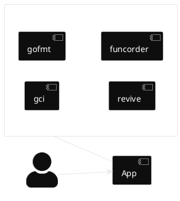
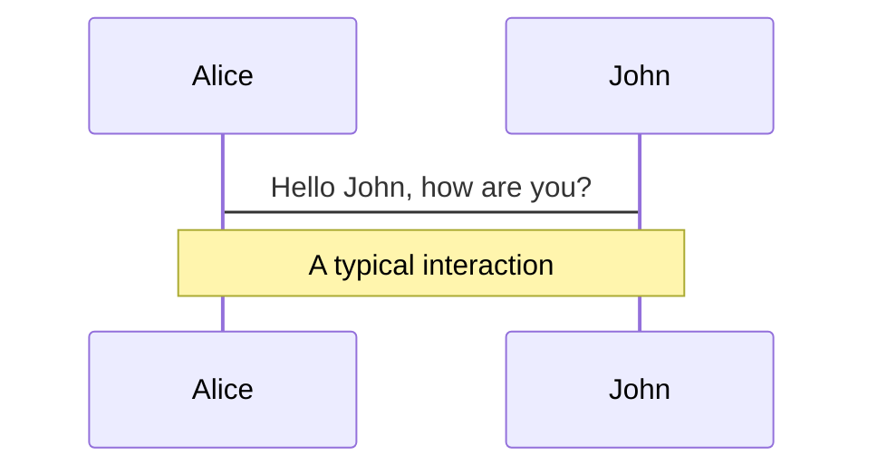
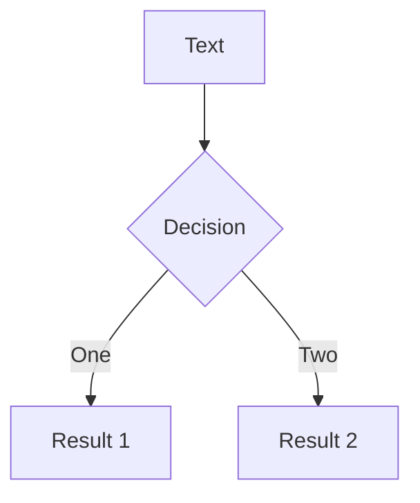
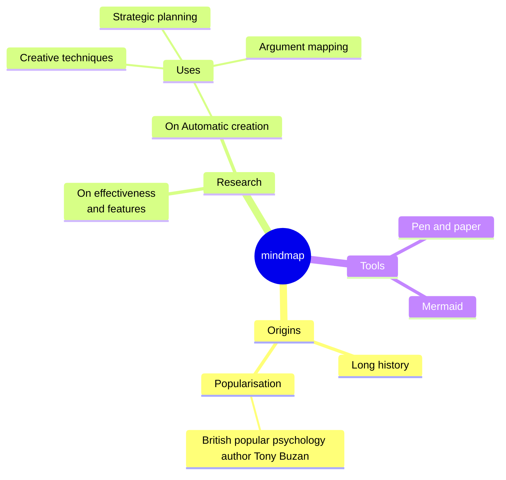
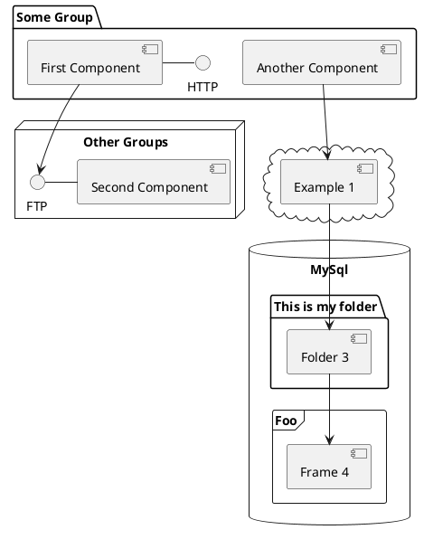

---
# try also 'default' to start simple
theme: seriph
# random image from a curated Unsplash collection by Anthony
# like them? see https://unsplash.com/collections/94734566/slidev
# background: https://cover.sli.dev
# some information about your slides (markdown enabled)
title: Create Your First Linter
info: |
  ## Slidev Starter Template
  Force your style guidelines from the beginning

  Learn more at [Sli.dev](https://sli.dev)
# apply UnoCSS classes to the current slide
class: text-center
# https://sli.dev/features/drawing
drawings:
  persist: false
# slide transition: https://sli.dev/guide/animations.html#slide-transitions
transition: slide-left
# enable MDC Syntax: https://sli.dev/features/mdc
mdc: true
# duration of the presentation
duration: 35min

---

# Create Your First Linter

Force your style guidelines from the beginning

<div class="abs-br m-6 text-xl">
  <a href="https://github.com/manuelarte/gophercamp-2026-create-your-first-linter" target="_blank" class="slidev-icon-btn">
    <carbon:logo-github />
  </a>
</div>

<!--
The last comment block of each slide will be treated as slide notes. It will be visible and editable in Presenter Mode along with the slide. [Read more in the docs](https://sli.dev/guide/syntax.html#notes)
-->

---
layout: statement
hideInToc: true
---

# What is a linter?

<div v-click class="bg-gray-100 dark:bg-gray-800 p-8 rounded-xl text-2xl shadow-lg mt-8">
  Automatically analyze source code for potential errors, 
  <span v-mark.circle.red="2">stylistic issues</span>, and violations of coding conventions
</div>

---
layout: image-right
image: assets/qr-github-manuelarte.jpeg
backgroundSize: 20em 60%
hideInToc: true
---

# About Me

```go [me.go] {2|all} twoslash
var Me = Developer{
	Name: "Manuel Doncel Martos",
	Skills: [][]string {
        {"☕Java", "Spring Boot"},
        {"🦫Go", "🐍Python"},
        {"Kubernetes", "Docker"},	
    },
    Interests: []string {
        "Open Source",
        "Domain Driven Design",
        "⚽Football",
    },
}
```

---
layout: center
hideInToc: true
---

# Goals

* Learn and create a linter.
* Integrate it with golangci-lint as a plugin.
* Create your own linter and share it.

<style>
    ul {
        font-size: 2em;
    }
</style>

---
layout: default
hideInToc: true
---

# Table of contents

<Toc text-2xl minDepth="1" maxDepth="1" />

---
layout: two-cols
transition: slide-up
---

# Golangci-lint

<br>

[Golangci-lint](https://golangci-lint.run/) is a fast linters runner for Go.

* Widely used.
* More than 100 linters.
* Linters & Formatters.

::right::



<style>
    ul {
        font-size: 2em;
    }
</style>

---
layout: two-cols
level: 2
transition: slide-up
---

# Tool Analyzer

## Package [golang.org/x/tools](https://pkg.go.dev/golang.org/x/tools)

<br>

- Node
- Analyzer
- Pass
- Diagnosis

::right::

Code
<<< @/snippets/run.go#snippet

<style>
    ul {
        font-size: 2em;
    }
</style>

---
level: 2
---

# AST Example

```plantuml
@startwbs
skinparam backgroundColor transparent
skinparam monochrome reverse
!option handwritten true

* ast.File
** ast.GenDecl
*** ast.ImportSpec
**** ast.BasicLit
** ast.GenDecl
*** ast.ValueSpec
**** ast.Ident
**** ast.BasicLit
** ast.GenDecl
*** ast.TypeSpec
*** ast.StructType
**** ast.FieldList
***** ast.Field
***** ast.Field
** ast.FuncDecl
*** ast.FuncType
*** ast.FieldList
**** ast.Field
**** ast.Field
** ...
@endwbs
```

<!-- Footer -->

<div class="absolute left-30px bottom-30px">
  <a target="_blank" href="https://github.com/manuelarte/gophercamp-2026-create-your-first-linter/blob/main/astexample/testdata/src/simple/simple.go">File to test</a>
</div>


---
layout: section
transition: slide-up
---

# My First Linter

---
layout: two-cols-header
level: 2
---

# My First Linter
                       
## [Prefix unexported globals with '`_`' ](https://github.com/uber-go/guide/blob/master/style.md#prefix-unexported-globals-with-_)

<br>

Prefix unexported top-level vars and consts with _ to make it clear when they are used that they are global symbols.

::left::

❌ Bad        

```go
const myConstant = "myConstant"
const errNotFound = "not found"
```

::right::

✅ Good     

```go
const _myConstant = "myConstant"
const errNotFound = "not found"
```  

<style>
.two-cols-header {
  column-gap: 20px;
}
</style>

---

# Diagrams

You can create diagrams / graphs from textual descriptions, directly in your Markdown.

<div class="grid grid-cols-4 gap-5 pt-4 -mb-6">









</div>

Learn more: [Mermaid Diagrams](https://sli.dev/features/mermaid) and [PlantUML Diagrams](https://sli.dev/features/plantuml)

---
foo: bar
dragPos:
  square: 691,32,167,_,-16
---

# Draggable Elements

Double-click on the draggable elements to edit their positions.

<br>

###### Directive Usage

```md

```

<br>

###### Component Usage

```md
<v-drag text-3xl>
  <div class="i-carbon:arrow-up" />
  Use the `v-drag` component to have a draggable container!
</v-drag>
```

<v-drag pos="663,206,261,_,-15">
  <div text-center text-3xl border border-main rounded>
    Double-click me!
  </div>
</v-drag>


###### Draggable Arrow

```md
<v-drag-arrow two-way />
```

<v-drag-arrow pos="67,452,253,46" two-way op70 />

---
src: ./pages/imported-slides.md
hide: false
---

---

# Monaco Editor

Slidev provides built-in Monaco Editor support.

Add `{monaco}` to the code block to turn it into an editor:

```ts {monaco}
import { ref } from 'vue'
import { emptyArray } from './external'

const arr = ref(emptyArray(10))
```

Use `{monaco-run}` to create an editor that can execute the code directly in the slide:

```ts {monaco-run}
import { version } from 'vue'
import { emptyArray, sayHello } from './external'

sayHello()
console.log(`vue ${version}`)
console.log(emptyArray<number>(10).reduce(fib => [...fib, fib.at(-1)! + fib.at(-2)!], [1, 1]))
```

---
layout: center
class: text-center
---

# Learn More

[Documentation](https://sli.dev) · [GitHub](https://github.com/slidevjs/slidev) · [Showcases](https://sli.dev/resources/showcases)

<PoweredBySlidev mt-10 />
