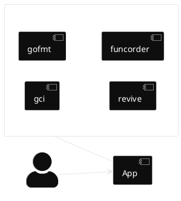

---
# try also 'default' to start simple
theme: seriph
# random image from a curated Unsplash collection by Anthony
# like them? see https://unsplash.com/collections/94734566/slidev
# background: https://cover.sli.dev
# some information about your slides (markdown enabled)
title: Create Your First Linter
info: |
  ## Slidev Starter Template
  Force your style guidelines from the beginning

  Learn more at [Sli.dev](https://sli.dev)
# apply UnoCSS classes to the current slide
class: text-center
# https://sli.dev/features/drawing
drawings:
  persist: false
# slide transition: https://sli.dev/guide/animations.html#slide-transitions
transition: slide-left
# enable MDC Syntax: https://sli.dev/features/mdc
mdc: true
# duration of the presentation
duration: 35min
hideInToc: true
---

# Create Your First Linter

Force your style guidelines from the beginning

<div class="abs-br m-6 text-xl">
  <a href="https://github.com/manuelarte/gophercamp-2026-create-your-first-linter" target="_blank" class="slidev-icon-btn">
    <carbon:logo-github />
  </a>
</div>

<!--
The last comment block of each slide will be treated as slide notes. It will be visible and editable in Presenter Mode along with the slide. [Read more in the docs](https://sli.dev/guide/syntax.html#notes)
-->

---
layout: statement
hideInToc: true
---

# What is a linter?

<div v-click class="bg-gray-100 dark:bg-gray-800 p-8 rounded-xl text-2xl shadow-lg mt-8">
  Automatically analyze source code for potential errors, 
  <span v-mark.circle.red="2">stylistic issues</span>, and violations of coding conventions
</div>

---
layout: image-right
image: /qr-github-manuelarte.jpeg
backgroundSize: 20em 60%
hideInToc: true
---

# About Me

```go [me.go] {2|all} twoslash
var Me = Developer{
	Name: "Manuel Doncel Martos",
	Skills: [][]string {
        {"☕Java", "Spring Boot"},
        {"🦫Go", "🐍Python"},
        {"Kubernetes", "Docker"},	
    },
    Interests: []string {
        "Open Source",
        "Domain Driven Design",
        "⚽Football",
    },
}
```

---
layout: center
hideInToc: true
---

# Goals

* Learn and create a linter.
* Integrate it with golangci-lint as a plugin.
* Create your own linter and share it.

<style>
    ul {
        font-size: 2em;
    }
</style>

---
layout: default
hideInToc: true
---

# Table of contents

<Toc text-2xl minDepth="1" maxDepth="1" />

---
layout: two-cols
transition: slide-up
---

# Golangci-lint

<br>

[Golangci-lint](https://golangci-lint.run/) is a fast linters runner for Go.

* Widely used.
* More than 100 linters.
* Linters & Formatters.

::right::



<style>
    ul {
        font-size: 2em;
    }
</style>

---
layout: two-cols
level: 2
transition: slide-up
---

# Tool Analyzer

## Package [golang.org/x/tools](https://pkg.go.dev/golang.org/x/tools)

<br>

- Node
- Analyzer
- Pass
- Diagnosis

::right::

Code
<<< @/snippets/run.go#snippet

<style>
    ul {
        font-size: 2em;
    }
</style>

---
level: 2
---

# AST Example

```plantuml
@startwbs
skinparam backgroundColor transparent
skinparam monochrome reverse
!option handwritten true

* ast.File
** ast.GenDecl
*** ast.ImportSpec
**** ast.BasicLit
** ast.GenDecl
*** ast.ValueSpec
**** ast.Ident
**** ast.BasicLit
** ast.GenDecl
*** ast.TypeSpec
*** ast.StructType
**** ast.FieldList
***** ast.Field
***** ast.Field
** ast.FuncDecl
*** ast.FuncType
*** ast.FieldList
**** ast.Field
**** ast.Field
** ...
@endwbs
```

<!-- Footer -->

<div class="absolute left-30px bottom-30px">
  <a target="_blank" href="https://github.com/manuelarte/gophercamp-2026-create-your-first-linter/blob/main/astexample/testdata/src/simple/simple.go">File to test</a>
</div>


---
layout: section
transition: slide-up
---

# My First Linter

---
layout: two-cols-header
level: 2
transition: slide-up
---

# My First Linter
                       
## [Prefix unexported globals with '`_`' ](https://github.com/uber-go/guide/blob/master/style.md#prefix-unexported-globals-with-_)

<br>

Prefix unexported top-level vars and consts with _ to make it clear when they are used that they are global symbols.

::left::

❌ Bad        

```go
const myConstant = "myConstant"
const errNotFound = "not found"
```

::right::

✅ Good     

```go
const _myConstant = "myConstant"
const errNotFound = "not found"
```

<style>
.two-cols-header {
  column-gap: 20px;
}
</style>

---
level: 2
transition: slide-up
---

# Let's


---
level: 2
layout: center
transition: slide-up
---

# Comments

- Stylistic linters helps to reduce cognitive load.
- Be consistent.


<style>
ul {
  font-size: 2em;
}
</style>

---
layout: center
transition: slide-up
---

# Integrate Custom Lint

- As a standalone binary
- As a plugin for golangci-lint

<style>
ul {
  font-size: 2em;
}
</style>

---
level: 2
layout: center
transition: slide-up
---

# Standalone Binary

<br>
<br>

```bash
$ go build -o unexportedconstantscheck ./cmd/.
$ unexportedconstantscheck --fix ./...
```

---
level: 2
layout: center
transition: slide-up
---

# [golangci-lint Plugin](https://golangci-lint.run/plugins/module-plugins/)

<br>

- Custom golangci-lint binary
- Custom linter added to that binary

[Example](https://github.com/manuelarte/gophercamp-2026-create-your-first-linter/tree/main/custom-plugin)

---
level: 2
---

# Let's


---
layout: center
hideInToc: true
---

# Takeaways

- Easy to create custom linters.
- Reduce cognitive load.
- Enjoyable experience.

<style>
    ul {
        font-size: 2em;
    }
</style>

---
hideInToc: true
layout: image
image: /q_a.jpeg
backgroundSize: contain
---

# Q/A
